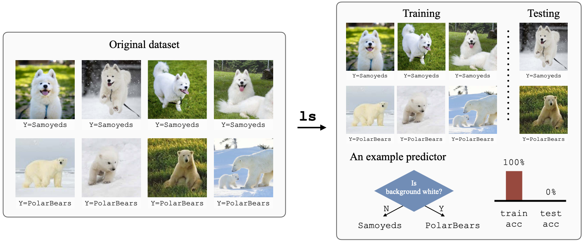

# Learning to split 

This is the official implementation for "[Learning to Split for Automatic Bias Detection](https://arxiv.org/abs/2204.13749)."

`ls` can learn to automatically split any dataset, such that models trained on the training set will not generalize to the testing set. The resultant splits are valuable as they can help us debug the dataset. *What are the minority groups? Are there any annotation errors?* Analyzing these challenging splits can guide us towards a more robust model.

<p align="center">

</p>

Consider the task of classifying samoyed images vs. polar bear images. In this example, the learned splits help us identify the hidden bias: background color. While predictors can achieve perfect performance on the training split by using the spurious heuristic: polar bears live in snowy habitats, they fail to generalize to the under-represented group (polar bears that appear on grass).

**Key features:**
+ Automatically identifies challenging train/test splits for any `torch.utils.data.Dataset` object.
+ Supports all `torchvision` classification models with pre-trained weights.
+ Supports custom models.
+ Supports all optimizers and learning rate schedulers under `torch.optim`


## Installation
```bash
# It is always a good practice to use a new conda/virtual env :)
conda create --name ls python=3.9
conda activate ls
pip install git+https://github.com/YujiaBao/ls.git#egg=ls
```
`ls` is tested on Python 3.9 with PyTorch 1.12.1.

## Quickstart

You can directly use the `ls.learning_to_split()` interface to generate challenging splits on PyTorch dataset object. Here is a quick example using the Tox21 dataset:

```python
>>> import ls

# Load the Tox21 dataset.
>>> data = ls.datasets.Tox21()

# Learning to split the Tox21 dataset.
# Here we use a simple mlp as our model backbone and use roc_auc as the evaluation metric.
>>> train_data, test_data = ls.learning_to_split(data, model={'name': 'mlp'}, metric='roc_auc')

Best split:
ls outer loop 9 @ 23:51:42 2022/10/17
| generalization gap 64.31 (val 98.97, test 34.65)
| train count 72.7% (7440)
| test  count 27.3% (2800)
| train label dist {0: 7218, 1: 222}
| test  label dist {0: 2627, 1: 173}
```
By default, `learning_to_split` will output the split status for each outer loop iteration (see [tox21.log](assets/tox21.log) for the full log). In this example, we see that `ls` converged after 9 iterations. It identified a very challenging train/test split (generalization gap = 64.31%).

In some cases, one may want to access the indices of the training/testing data or examine the learned dataset splitter. Users can tailor the output to their own needs through the `return_order` argument.
```python
train_data, test_data, train_indices, test_indices, splitter = ls.learning_to_split(
    data, model={'name': 'mlp'},
    return_order=['train_data', 'test_data', 'train_indices', 'test_indices', 'splitter']
)
# splitter:                    The learned splitter (torch.nn.Module)
# train_data, test_data:       The training and testing dataset (torch.utils.data.Dataset).
# train_indices, test_indices: The indices of the training/testing examples in the original dataset (list[int])
```

## Models
### Built-in models
```python
# List all built-in models.
>>> ls.models.builtin_models
['mnistcnn', 'mlp', 'bert', 'textcnn', 'alexnet', 'convnext_tiny', 'convnext_small', 'convnext_base', 'convnext_large', 'densenet121', 'densenet161', 'densenet169', 'densenet201', 'efficientnet_v2_s', 'efficientnet_v2_m', 'efficientnet_v2_l', 'efficientnet_b0', 'efficientnet_b1', 'efficientnet_b2', 'efficientnet_b3', 'efficientnet_b4', 'efficientnet_b5', 'efficientnet_b6', 'efficientnet_b7', 'googlenet', 'inception_v3', 'mnasnet0_5', 'mnasnet0_75', 'mnasnet1_0', 'mnasnet1_3', 'mobilenet_v2', 'mobilenet_v3_large', 'mobilenet_v3_small', 'regnet_y_400mf', 'regnet_y_800mf', 'regnet_y_1_6gf', 'regnet_y_3_2gf', 'regnet_y_8gf', 'regnet_y_16gf', 'regnet_y_32gf', 'regnet_y_128gf', 'regnet_x_400mf', 'regnet_x_800mf', 'regnet_x_1_6gf', 'regnet_x_3_2gf', 'regnet_x_8gf', 'regnet_x_16gf', 'regnet_x_32gf', 'resnet18', 'resnet34', 'resnet50', 'resnet101', 'resnet152', 'resnext50_32x4d', 'resnext101_32x8d', 'resnext101_64x4d', 'wide_resnet50_2', 'wide_resnet101_2', 'shufflenet_v2_x0_5', 'shufflenet_v2_x1_0', 'shufflenet_v2_x1_5', 'shufflenet_v2_x2_0', 'squeezenet1_0', 'squeezenet1_1', 'swin_t', 'swin_s', 'swin_b', 'vgg11', 'vgg11_bn', 'vgg13', 'vgg13_bn', 'vgg16', 'vgg16_bn', 'vgg19', 'vgg19_bn', 'vit_b_16', 'vit_b_32', 'vit_l_16', 'vit_l_32', 'vit_h_14']
```
`ls` supports the following models:
+ [mlp](./ls/models/mlp.py): a simple multi-layer perceptron for inputs with fixed-dimensional features.
+ [textcnn](./ls/models/textcnn.py): a one-dimensional conv net for text classification with pre-trained word embeddings.
+ [bert](./ls/models/bert.py): BERT for sequence classification.
+ [mnistcnn](./ls/models/mnistcnn.py): a two-layer conv net for MNIST digit classification.

Thanks to `torchvision`, `ls` also supports the following classification models with pre-trained weights:
+ [AlexNet](https://pytorch.org/vision/stable/models/alexnet.html): `alexnet`
+ [ConvNeXt](https://pytorch.org/vision/stable/models/convnext.html): `convnext_tiny`, `convnext_small`, `convnext_base`, `convnext_large`
+ [DenseNet](https://pytorch.org/vision/stable/models/densenet.html): `densenet121`, `densenet161`, `densenet169`, `densenet201`
+ [EfficientNet](https://pytorch.org/vision/stable/models/efficientnet.html): `efficientnet_b0`, `efficientnet_b1`, `efficientnet_b2`, `efficientnet_b3`, `efficientnet_b4`, `efficientnet_b5`, `efficientnet_b6`, `efficientnet_b7`
+ [EfficientNet V2](https://pytorch.org/vision/stable/models/efficientnetv2.html): `efficientnet_v2_s`, `efficientnet_v2_m`, `efficientnet_v2_l`
+ [GoogLeNet](https://pytorch.org/vision/stable/models/googlenet.html): `googlenet`
+ [Inception V3](https://pytorch.org/vision/stable/models/inception.html): `inception_v3`
+ [MNASNet](https://pytorch.org/vision/stable/models/mnasnet.html): `mnasnet0_5`, `mnasnet0_75`, `mnasnet1_0`, `mnasnet1_3`
+ [MobileNet V2](https://pytorch.org/vision/stable/models/mobilenetv2.html): `mobilenet_v2`
+ [MobileNet V3](https://pytorch.org/vision/stable/models/mobilenetv3.html): `mobilenet_v3_small`, `mobilenet_v3_large`
+ [RegNet](https://pytorch.org/vision/stable/models/regnet.html): `regnet_y_400mf`, `regnet_y_800mf`, `regnet_y_1_6gf`, `regnet_y_3_2gf`, `regnet_y_8gf`, `regnet_y_16gf`, `regnet_y_32gf`, `regnet_y_128gf`, `regnet_x_400mf`, `regnet_x_800mf`, `regnet_x_1_6gf`, `regnet_x_3_2gf`, `regnet_x_8gf`, `regnet_x_16gf`, `regnet_x_32gf`
+ [ResNet](https://pytorch.org/vision/stable/models/resnet.html): `resnet18`, `resnet34`, `resnet50`, `resnet101`, `resnet152`
+ [ResNeXt](https://pytorch.org/vision/stable/models/resnext.html):  `resnext50_32x4d`, `resnext101_32x8d`, `resnext101_64x4d`
+ [ShuffleNet V2](https://pytorch.org/vision/stable/models/shufflenetv2.html): `shufflenet_v2_x0_5`, `shufflenet_v2_x1_0`, `shufflenet_v2_x1_5`, `shufflenet_v2_x2_0`
+ [SqueezeNet](https://pytorch.org/vision/stable/models/squeezenet.html): `squeezenet1_0`, `squeezenet1_1`
+ [SwinTransformer](https://pytorch.org/vision/stable/models/swin_transformer.html): `swin_t`, `swin_s`, `swin_b`
+ [VGG](https://pytorch.org/vision/stable/models/vgg.html): `vgg11`, `vgg11_bn`, `vgg13`, `vgg13_bn`, `vgg16`, `vgg16_bn`, `vgg19`, `vgg19_bn`
+ [VisionTransformer](https://pytorch.org/vision/stable/models/vision_transformer.html): `vit_b_16`, `vit_b_32`, `vit_l_16`, `vit_l_32`, `vit_h_14`
+ [Wide ResNet](https://pytorch.org/vision/stable/models/wide_resnet.html): `wide_resnet50_2`, `wide_resnet101_2`

For example to use `EfficientNetV2-L`, one can run
```python
train_data, test_data = ls.learning_to_split(data, model={'name': 'efficientnet_v2_l'})
```

### Custom models
Users can also use their custom models in `ls.learning_to_split()`. In the following example, we will register a new model `custom` into the model factory. Checkout [customize.py](bin/custom_model.py) for a more detailed example.

```python
from ls.models.build import ModelFactory

@ModelFactory.register('custom')
class custom(nn.Module):
    '''
       Define a fancy custom class here.
    '''

# kwargs will be passed to initializer of the custom class.
train_data, test_data = ls.learning_to_split(data, model={'name': 'custom', 'args': kwargs})
```

### Optimizers and learning rate schedulers
**Why do we need to specify this?** The algorithm learning to split has two components: *splitter* and *predictor*. On a high level, the splitter partitions the original dataset into a training set and a testing set at each iteration. The predictor then estimates the generalization gap of the current split, providing learning signal for the splitter. Depending on the dataset and the model configurations, the optimization settings (for the splitter and the predictor) are often different.

`ls.learning_to_split()` supports all optimization algorithms under `torch.optim` and all learning rate schedulers under `torch.optim.lr_scheduler`. In the following example, we will define an optimizer and a learning rate scheduler for the algorithm.

```python
# Define the optimizer.
# optim['args'] specifies the keyword arguments for torch.optim.Adam()
optim = {
    'name': 'Adam',
    'args': {
        'lr': 1e-3
	'weight_decay': 1e-4
    }
}

# Define the learning rate scheduler.
# lr_scheduler['args'] specifies the keyword arguments for torch.optim.lr_scheduler.StepLR()
lr_scheduler = {
    'name': 'StepLR',
    'args': {
        'step_size': 30,
	'gamma': 0.1
    }
}

# Run learning_to_split with the specified model, optimizer and learnign rate scheduler.
train_data, test_data = ls.learning_to_split(data, model={'name': 'mlp'}, optim=optim, lr_scheduler=lr_scheduler)
```

## Datasets
### Built-in datasets
`ls` contains the following built-in datasets:
+ [`BeerReviews`](./ls/datasets/BeerReviews.py) BeerAdvocate reviews for aspect-level sentiment classification. *Text classification.*
+ [`MNLI_bert_uncased`](./ls/datasets/MNLI_bert_uncased.py) Multi-Genre Natural Language Inference with `bert-uncased` tokenization. *Text classification.*
+ [`NoisyMNIST`](./ls/datasets/NoisyMNIST.py) MNIST but with injected label noise. *Image classification.*
+ [`CelebA`](./ls/datasets/CelebA.py) Classifying blond_hair vs. not_blone_hair from human face images. *Image classification.*
+ [`Waterbirds`](./ls/datasets/Waterbirds.py) Classifying waterbirds vs. landbirds from bird images. *Image classification.*
+ [`Tox21`](./ls/datasets/Tox21.py) Predicting a specific binary property (`NR.AR`) from a given molecule. *Molecule classification.*

The built-in datasets will be cached under `datasets/`

### Custom datasets
Users can easily run `learning_to_split` on their own datasets. The only requirments are
+ The dataset needs to be a `torch.utils.data.Dataset` object.
+ We expect `__getitem__(self, idx)` to return a tuple: `(input, target)`.

Here is a quick example of a custom dataset.
```python
import ls
from torch.utils.data import Dataset                                                                                                                                               

class CustomData(Dataset):
    def __init__(self):
        # Create a random 1644-dimensional data
        self.data = torch.rand([100, 1644])
	# Create a binary label tensor
        self.targets = torch.cat([torch.ones([50]), torch.zeros([50])]).long()
	self.length = len(self.targets)

    def __len__(self):
        return self.length

    def __getitem__(self, idx):
        return self.data[idx], self.targets[idx]

data = CustomData()
train_data, test_data = ls.learning_to_split(data, model={'name': 'mlp'})
```

## Arguments
The default configurations are specified in [default.yaml](ls/configs/default.yaml).
+ `data`:  The dataset that we want to split. **This argument is required.**
+ `device`: The device (gpu/cpu) that we want to use. Default: `'cuda:0'`
+ `model`
  + `'name'`: The name (str) of the model class that we want to use. **This argument is required.**
  + `'args'`: Keyword arguments for initializing the specific model. Default: `{}`
+ `optim`:
  + `'name'`: Name of the optimizer that we want to use. See `torch.optim` for the available options. Default: `'Adam'`
  + `'args'`: Keyword arguments for creating the optimizer. Default: `{'lr': 0.001, 'weight_decay': 0}`
+ `lr_scheduler`:
  + `'name'`: Name of the learning rate scheduler that we want to use. See `torch.optim` for the available options. Default: `None`
  + `'args'`: Keyword arguments for creating the optimizer. Default: `{}`
+ `num_workers`: Number of workers that we want to use for data loading. Default: `3`
+ `batch_size`: Number of examples for each batch. Default: `200`
+ `num_batches`: Number of batches for each epoch. Default: `100`
+ `num_classes`: Number of classes for the classification task. Default: `2`
+ `num_outer_loop`: Maximum outer loop iterations in ls training. Default: `100`
+ `patience`: Terminate `ls` if the split hasn't improved for `patience` iterations. Default: `5`
+ `ratio`: The ratio of the train_size / (train_size + test_size). Default: `0.75`
+ `w_gap`: Weight for the generalization gap loss term. Default: `1`
+ `w_ratio`: Weight for the train/test ratio regularizer. Default: `1`
+ `w_balance`: Weight for the train/test label distribution regularizer. Default: `1`
+ `convergence_thres`: Threshold for the splitter convergence criteria. Default: `0.001`
+ `metric`: The metric that we use for evaluating the performance. Default: `'accuracy'`


## Citation
If you want to know more, check out our paper "[Learning to Split for Automatic Bias Detection](https://arxiv.org/abs/2204.13749)."
```
@article{bao2022learning,
  title={Learning to Split for Automatic Bias Detection},
  author={Bao, Yujia and Barzilay, Regina},
  journal={arXiv preprint arXiv:2204.13749},
  year={2022}
}
```
